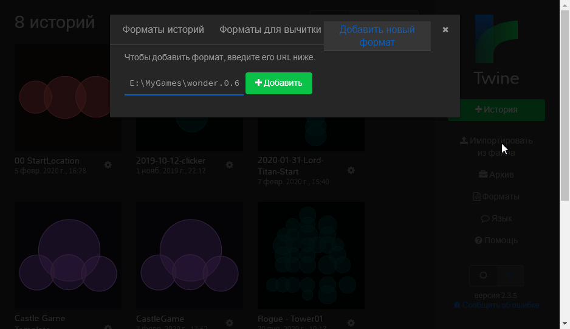

# Wonder - Twine text quest format

Это открытый и бесплатный формат текстовых квестов для Twine. Особенности
- можно настраивать [картинки, фон и цвет каждой локации](docs/DESIGN.md)
- можно подключать [готовые темы оформления](format/templates/README.md) 
- ориентация на модульную работу с дизайном через CSS

Каждая локация в теге body получает уникальный id - это позволяет добавлять любое оформление для нужной локации через CSS.

## Последняя версия - 0.6.22
- [Меню игры](docs/Menu.md)
    - рестарт
    - дополнительные команды

## Последняя версия - 0.6.21
Главные изменения
   - save по-прежнему может быть вызван как прямая команда в нужный слот
   - saveSlot определяет сохранение для save (но не для AutoSave)
   - у автосейва и автозагрузки - свой отдельный слот под сейвы, как и полагается в нормальных играх
   - стартовый экран с кнопками New Game, Continue - создается движком, а не в редакторе Twine
   - [перезапуск](docs/Restart.md) с любого экрана на любой экран
   - прямой load пока отключен
     

## v0.6.19
2020.05.10
- [Wonder.restart()](docs/Restart.md);
- [Wonder.hasSave()](docs/SaveLoad.md);
- [Wonder.pageAdd('tag', 'text')](docs/WonderCommands.md) - - Добавить текст на все страницы с тегом tag;
- [Wonder.showText(text)](docs/WonderCommands.md);

2020.05.06
- исправлен баг внешнего API для автосейва
- добавлено [подключение внешниех скриптов](docs/ScriptsExternal.md)


2020.05.04
- добавлены [теги](docs/Tags.md) как классы в линки на страницы;
- добавлены [Save/Loads](docs/SaveLoad.md)
- добавлены [переменные и скрипты JavaScript](docs/Scripts.md);

[Полный список изменений](docs/CHANGELOG.md)


## Установка 

Откройте Twine, нажмите "Форматы", затем "Добавить новый формат". Вставьте URL или полный путь к локальному файлу.

URL:
```html
https://kvisaz.github.io/twine-wonder/format/format/0.6.22/wonder.js
```



Второй вариант - скачать и установить со своего компа:

## Установка из локального файла
Если не хотите зависеть от качества связи или доступности GitHub - рекомендую [скачать архив с форматом](format/format/0.6.22.zip), распаковать его в любую удобную папку на своем компьютере и указать при установке полный путь к файлу. К примеру, 
```html
D:\work\PLAYTEXT\wonder-format\0.6.22\wonder.js
```

Редактор Twine загружает кастомные форматы при запуске каждый раз - поэтому установка из локального файла, который лежит на вашем компьютере - гарантирует  стабильность проекта и его независимость от сети, внезапных апдейтов формата или доступности GitHub

## Документация
- [Кастомные скрипты](docs/Scripts.md)
- [Команды Wonder](docs/WonderCommands.md)
- [Save/Load](docs/SaveLoad.md)
- [Как сделать стартовую страницу](docs/StartPage.md)
- [Темы оформления](format/templates/README.md)
- [Как настроить фон и картинки в текстовом квесте](docs/DESIGN.md)
- [ChangeLog](docs/CHANGELOG.md)
