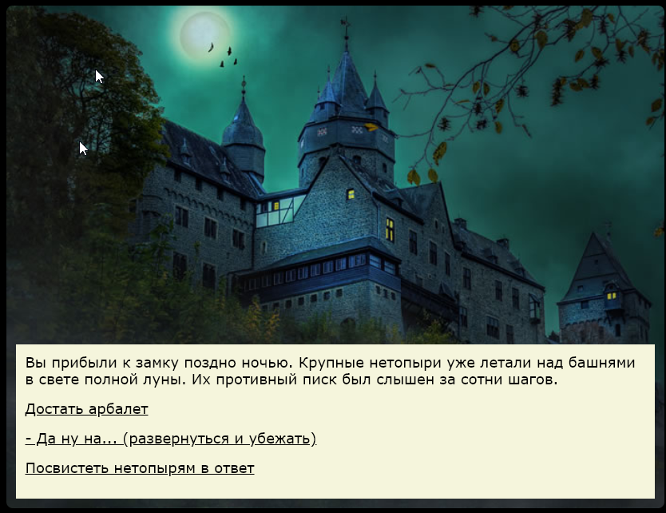

# Wonder - Twine text quest format

Это открытый и бесплатный формат текстовых квестов для Twine.

Чтобы установить формат Wonder последней версии:

1. [скачайте последний пак Wonder](format/pack/wonder.0.6.1.zip) на свой компьютер
2. разархивируйте ZIP-архив в любую удобную для вас папку, которая будет жить
3. откройте Twine, нажмите "Форматы", затем "Добавить новый формат"
4. вставьте полный путь к файлу `wonder.js`, который лежит в папке `format`

Примечание: Так можно вставлять и URL (обычный способ для установки кастомных форматов), но установка из формата, который лежит на вашем компьютере - гарантирует  стабильность проекта и его независимость от сети, внезапных апдейтов формата или доступности GitHub

## Установка темы - графического шаблона

В скачанном выше архиве есть папка templates. В ней лежат шаблоны с готовым оформлением, которое можно использовать в вашем проекте (картинки и дизайн являются свободно распространяемыми). К примеру, CastleTemplate:

Чтобы использовать этот шаблон - 
1. скопируйте его в отдельную папку проекта, где будет жить ваша игра в будущем перед релизом.  К примеру, `E:\MyGames\CastleQuest`
2. импортируйте файл template.html из этой папки в Twine как историю. 
3. поменяйте название истории с дефолтного на название вашей игры - к примеру, К примеру, `Castle Quest`. Иначе Twine при следующем импорте шаблона просто заменит старую игру.

После редактирования новой истории - экспортируйте её обратно в ту же папку, К примеру, `E:\MyGames\CastleQuest`. 

После этого можете открыть экспортированный файл в браузере и посмотреть, как выглядит игра с картинками.

Подробности по тому, как менять дизайн и  картинки 
- [Как настроить фон и картинки в текстовом квесте](docs/DESIGN.MD)

## Полезные ссылки
- [Как настроить фон и картинки в текстовом квесте](docs/DESIGN.MD)
- [Архив старых паков](docs/ARCHIVE.MD)
