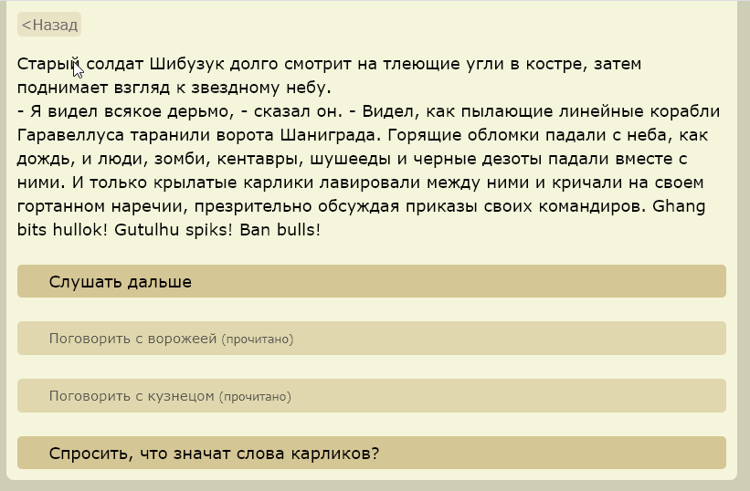

#ChangeLog
## Последняя версия - 0.6.19
2020.05.10
- [Wonder.restart()](docs/Restart.md);
- [Wonder.hasSave()](docs/SaveLoad.md);
- [Wonder.pageAdd('tag', 'text')](docs/WonderCommands.md) - - Добавить текст на все страницы с тегом tag;
- [Wonder.showText(text)](docs/WonderCommands.md);

## 0.6.17 - 0.6.18
2020.05.06
- отладка save/load для внешнего API

## 0.6.16
2020.05.06
- добавлено [подключение внешниех скриптов](docs/ScriptsExternal.md)

## v 0.6.15
2020.05.04
- исправлен баг с кнопкой "Назад", которая перелистывала на 2 локации вместо одной

## v 0.6.14
2020.05.04
- добавлены [теги](docs/Tags.md) как классы в линки на страницы;

### v 0.6.13
2020.05.04
- добавлены [Save/Loads](docs/SaveLoad.md)
- добавлены [переменные и скрипты JavaScript](docs/Scripts.md);

### v.0.6.12
2020.04.21
- добавлено подключение внешних css через скрипт `Wonder.styleUrl('mystyle.css');`
- добавлена кнопка "Назад";
- добавлена история и отметка уже прочитанных страниц.

### v.0.6.10

2020.03.19
- добавлена кнопка "Назад";
- добавлена история и отметка уже прочитанных страниц.

### v. 0.6.5  
20.02.2020
- Переводы в тексте теперь заменяются на переводы в самой игре (на br) - можно форматировать тексто отступами.
- ссылки теперь как кнопки

### v. 0.6.4 
Базовые возможности
