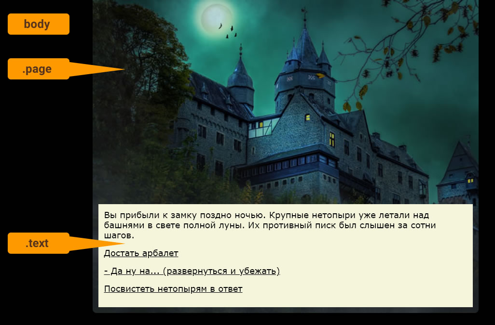

# Фон, цвет, картинки в Wonder 

Не забудьте сначала установить [формат Wonder](../README.md) - все правила действуют в нем.

Все задается через CSS (таблицы стилей). В шаблоне Wonder существует три глобальных селектора:
- body - для общего фона всей страницы в браузере и глобальных настроек
- .page - для видимых границ игры
- .text - для оформления текстового блока



Кроме этого, в каждой локации у `body` ставится id по имени локации в Twine (к примеру, `startGame` или `gameOver` или `goblinFight`). Это позволяет настраивать ВСЕ отдельно под каждую локацию - менять картинки, цвет фона и вообще все, что угодно.

Пример таблицы стилей из формата Castle Template:

```css
 body {
    background: black;
 }

 .text {
    background: beige;
    padding: 12px;
    margin-top: 400px;
 }

.page {
    background: url(img/image-castle-web.jpg) no-repeat;
    background-size: cover; 
 }
```

## Куда вставлять
В Twine кликните на названии игры в её редакторе и выберите "Редактировать таблицу стилей";

И вставляйте туда правила - вроде тех, что описаны ниже.
 

## Рецепты 
Как поменять общий цвет фон и шрифта игры - используем правило body:
```css
body{
    background: #e2d29f;  /*  это цвет фона */
    color: #152c3f;       /*  это цвет шрифта */  
}
```

Как поменять размер шрифта во всей игре - используем селектор body:
```css
body{
    font-size: 32px;  /*  это размер шрифта */
}
``` 

Как добавить фоновую картинку для всей игры - используем селектор body:

```css
 body {
     background: url(img/image-castle-web.jpg);
  }
```

Внимание! Все картинки будут видны только после экспорта (публикации) игры в папку, в которой есть вложенная папка img. В этот img надо складывать все картинки, которые вы хотите использовать в игре. 

По умолчанию фоновые картинки повторяются, как обои. Если это не нужно, пишем no-repeat в конце правила:
```css
 body {
     background: url(img/image-castle-web.jpg) no-repeat;
  }
```

### Как добавить общую картинку для всех локаций

Используем `.page` -
```css
 .page {
     background: url(img/image-castle-web.jpg) no-repeat;
  }
```


### Как добавить картинку в конкретную локацию
Используем `.page` и `id`, который подставляется по текущей локации. Допустим, в Twine вы хотите добавить картинку в локацию с названием `gameOver`. Значит, добавляем в таблицу стилей:

```css
#gameOver .page {
    background: url(img/gameOver.jpg) no-repeat;
    }   
```

### Меняем расположение текстового блока
В игре с картинкой текст можно сместить вниз за счет margin-top:

```css
 .text {
     margin-top: 300px; /* это расстояние сдвига, можете настраивать*/
  }
```

В конкретной локации пишите то же самое, но перед .page ставьте название локации с решеткой - это если нужно особое смещение в этой локации

```css
 #gameOver .text {
     margin-top: 100px; /* это расстояние сдвига, можете настраивать*/
  }
```


### Цвета текстового блока
Все очень просто - селектор .text

```css
.text {
    font-size: 32px;    /*  это размер шрифта */
    background: #e2d29f;    /*  это цвет фона */
    color: #152c3f;     /*  это цвет шрифта */  
}
```

Если знаете CSS - вам все доступно. Но и этих рецептов для многих случаев должно быть достаточно.

Главное, помните - картинки кладутся в папку проекта, куда вы экспортируете игру из Twine. И только после этого вы можете их протестировать.

А цвета и размеры - можно проверять и в Twine без экспорта.
