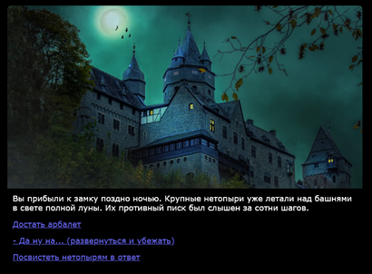

# Установка темы - графического шаблона для квеста

В формате Wonder есть [шаблоны с готовым оформлением](format/templates/README.md), которое можно использовать в вашем проекте (картинки и дизайн являются свободно распространяемыми). К примеру, CastleTemplate:


Чтобы использовать этот шаблон - 
1. скопируйте его в отдельную папку проекта, где будет жить ваша игра в будущем перед релизом.  К примеру, `E:\MyGames\CastleQuest`
2. импортируйте файл template.html из этой папки в Twine как историю. 
3. поменяйте название истории с дефолтного на название вашей игры - к примеру, К примеру, `Castle Quest`. Иначе Twine при следующем импорте шаблона просто заменит старую игру.

После редактирования новой истории - экспортируйте её обратно в ту же папку, К примеру, `E:\MyGames\CastleQuest`. 

После этого можете открыть экспортированный файл в браузере и посмотреть, как выглядит игра с картинками.

## Варианты шаблоны
В архиве шаблона может лежать несколько вариантов - они начинаются с `template`. К примеру, у шаблона Castle есть вариант `template-dark-text.html`, в котором у текста черный фон и он находится под картинкой.

 

## Как изменить или добавить картинки

1. в скачанной папке есть папка img - там лежат файлы с картинками. Можете их редактировать или копировать туда свои, такого же размера в пикселах (желательно, но если вы опытный дизайнер или фронтендер - можете делать что хотите)

2. в таблице стилей в Twine, чтобы добавить картинку - используйте селектор локации и `.page`, в url укажите нужное название картинки. Пример:
```css
#gameOver .page {
    background: url(img/gameOver.jpg) no-repeat;
    }   
```

Подробности по тому, как менять дизайн и  картинки 
- [Как настроить фон и картинки в текстовом квесте](DESIGN.md)
