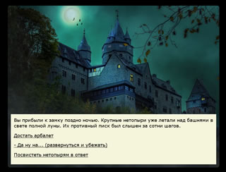

# Темы для текстового квеста

Это  примеры  дефолтного оформления текстового квеста в формате Wonder. Картинки и текст очищены от прав (Creative Common License 0).

Чтобы использовать тему в своей игре - скачайте архив, распакуйте, переименуйте её в название своей папки. Затем импортируйте template.html в Twine как историю. Картинки в Twine не будут видны, но сохранится цветовое оформление. После редактирование и добавления истории - опубликуйте её в ту же папку как index.html.

Подробности: [Как установить и использовать готовую тему для текстового квеста](../../docs/TEMPLATES.md)

Полезности: [как добавить свои картинки](docs/DESIGN.md)

## Castle Quest - 2020.02.07 

[Скачать архив](CastleTemplate.zip) 

